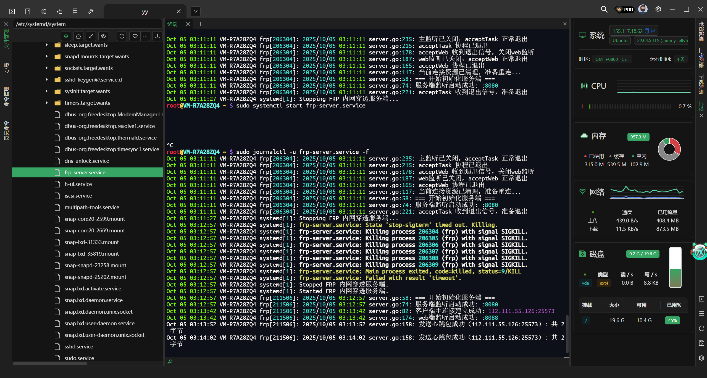
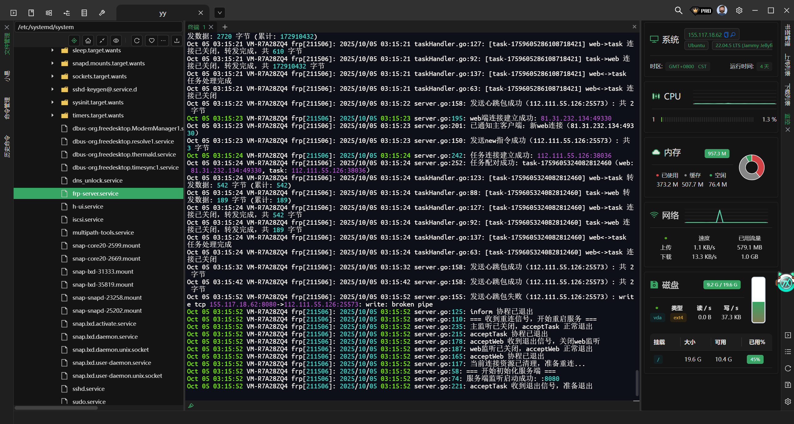
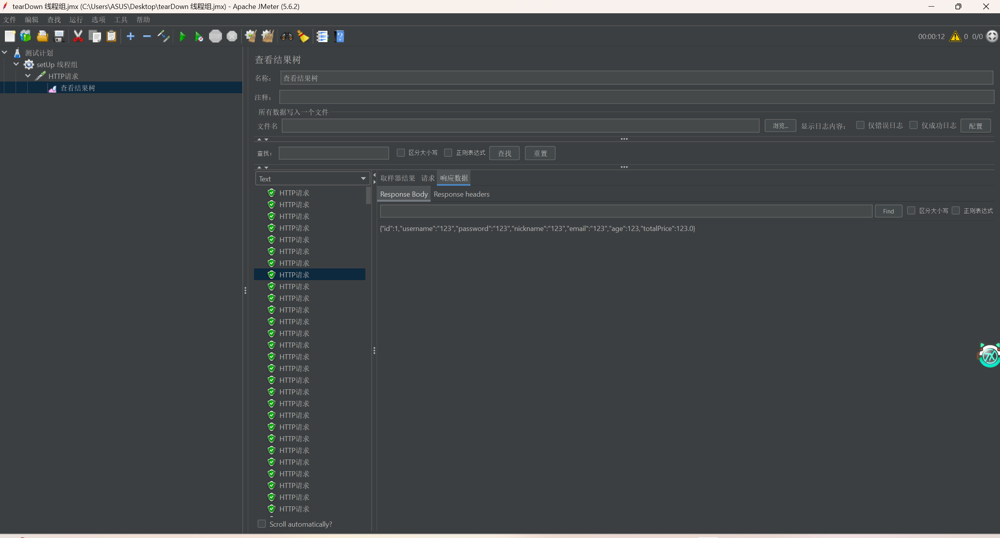
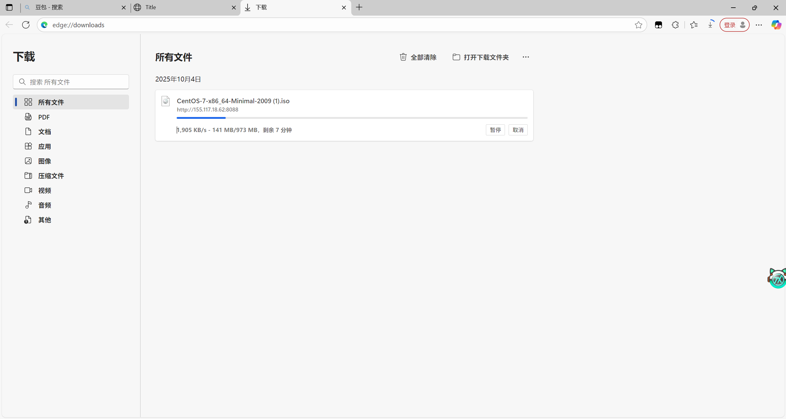

# Golang 内网穿透工具 - 高性能多协程网络穿透解决方案


一个基于 Golang 开发的高性能内网穿透工具，专为稳定传输和大文件传输优化设计。

## ✨ 核心特性

### 👍Master分支 支持多客户端多端口穿透

### 🚀 性能优化

- **多协程与通道配合** - 充分利用 Golang 并发特性，实现高性能数据传输
- **智能缓冲区管理** - 可配置读写缓冲区，优化内存使用效率
- **连接池技术** - 主连接+任务连接分离，确保大文件稳定传输

### 🔄 连接稳定性

- **心跳包机制** - 自动维护主连接健康状态
- **优雅重连策略** - 服务端自动重连，保证服务不中断
- **长连接超时管理** - 智能检测和处理超时连接

### ⚙️ 灵活配置

- **YAML 配置文件** - 支持手动配置各项参数
- **模块化设计** - 各组件参数可独立调整

## 🏗️ 架构说明

### 组件角色

- **Server 端** - 部署在具有公网 IP 的服务器，提供反向代理服务
- **Client 端** - 运行在内网环境，将本地服务暴露到公网

### 连接策略

text

```
公网用户 → Server(公网) → 主连接(控制) → Client(内网) → 本地服务
                            ↓
                     任务连接(数据传输)
```


## 📦 快速开始

### 环境要求

- Go 1.19 或更高版本
- 公网服务器（Server 端）
- 内网主机（Client 端）

### 安装运行

**Server 端部署**（公网服务器）

bash

```
# 默认 Web 服务端口：8088，Client 服务端口：8080
go run server.go
```


**Client 端部署**（内网主机）

bash

```
# 默认映射本地 8090 端口服务
go run client.go
```

## 🖥️ 运行截图

### 服务端运行状态

<div align="center">   <br> <em>服务端启动和连接监控</em> </div>

### 客户端连接状态

<div align="center">   <br> <em>客户端连接和服务映射</em> </div>

## ⚙️ 配置详解

yaml

```
# 通用配置
buffer-size: 512      # 缓冲区大小(kb)
keep-alive-time: 10   # 心跳包间隔(秒)
server-port: 8080     # 服务端端口
idle-timeout: 30      # 长连接超时时间(秒)

# 服务端配置
main-port: 8088       # 主服务端口
conn-chan-count: 100  # 连接通道大小

# 客户端配置  
server-ip: 127.0.0.1  # 服务端 IP 地址
local-port: 8090      # 本地服务端口
```


## 🧪 测试验证

### 压力测试

- **并发性能**：1秒500线程1000次循环，全部成功
- **稳定性**：长时间运行无内存泄漏
- **大文件传输**：支持 GB 级别文件稳定传输

### 测试截图

<div align="center">   <br> <em>并发压力测试结果</em> </div><div align="center">  <br> <em>大文件下载测试</em> </div>

## 🛠️ 使用场景

### 适用场景

- 🏠 家庭 NAS 外网访问
- 💻 远程办公环境搭建
- 🎮 游戏服务器部署
- 🔧 开发测试环境共享
- 📱 移动设备访问内网服务

### 典型应用

1. **Web 服务暴露** - 将本地开发的 Web 服务临时暴露到公网
2. **数据库远程访问** - 安全地访问内网数据库
3. **文件共享服务** - 搭建临时的文件分享服务
4. **API 测试** - 为移动应用提供测试环境

## 🔧 高级功能

### 性能调优

- 根据网络状况调整缓冲区大小
- 按需配置心跳频率平衡性能和稳定性
- 连接通道大小优化并发处理能力

### 监控管理

- 实时连接状态监控
- 流量统计和性能分析
- 异常连接自动清理

## 📊 性能指标

- **传输速度**：充分利用带宽，接近直连速度
- **连接稳定性**：心跳机制确保长连接不中断
- **资源占用**：智能内存管理，长时间运行稳定
- **并发支持**：高并发场景下表现优异

## 🔍 技术关键词

Golang 内网穿透、网络穿透、反向代理、多协程并发、长连接维护、心跳机制、大文件传输、网络隧道、端口映射、远程访问、内网服务暴露、Go 语言网络编程

## 🤝 贡献指南

欢迎提交 Issue 和 Pull Request 来改进这个项目！
