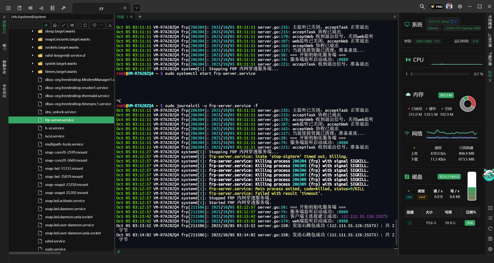
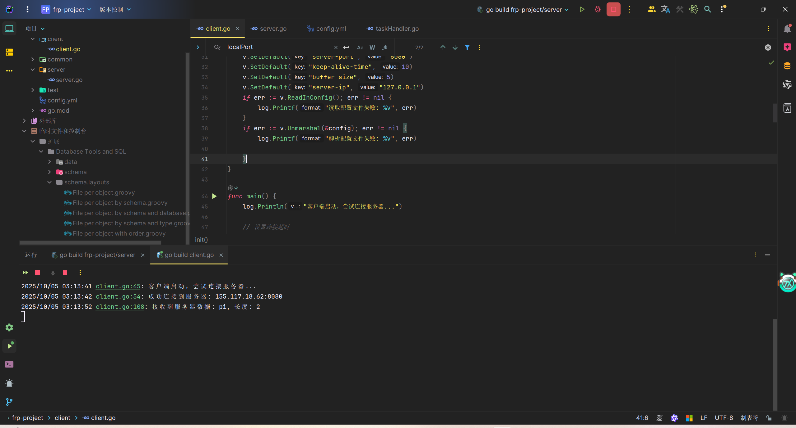
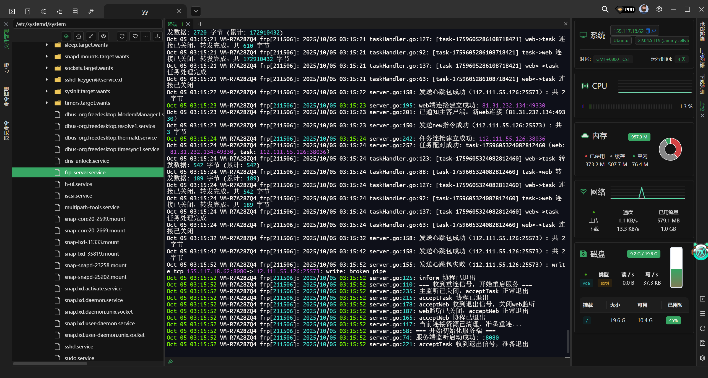
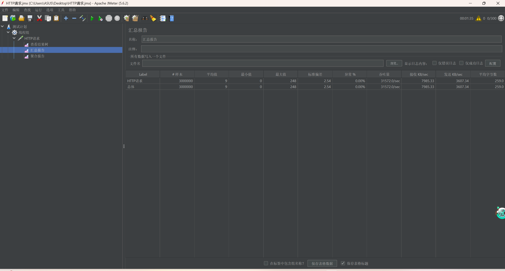
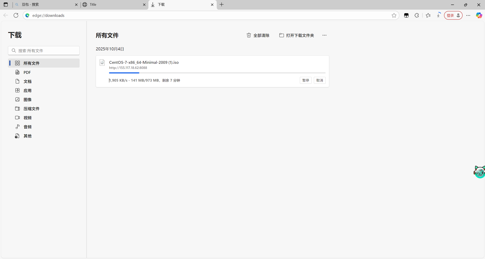

<div align="center">

# 🚀 Go-FRP

### 高性能 Golang 内网穿透工具

[](https://golang.org)
[](LICENSE)
[](https://github.com)
[](https://github.com)

**专为稳定传输和大文件传输优化设计的高性能内网穿透解决方案**

[✨ 特性](#-核心特性) • [📦 快速开始](#-快速开始) • [⚙️ 配置详解](#️-配置详解) • [📊 性能指标](#-性能指标) • [🔧 使用场景](#-使用场景)

---

</div>

## ✨ 核心特性

<table>
<tr>
<td width="50%">

### 🎯 功能特性

- ✅ **多客户端多端口穿透**
  支持同时映射多个本地服务

- 🔐 **密钥验证身份**
  每个连接可独立配置密钥

- 🚦 **智能流量控制**
  通道饱和时返回 HTTP 503 错误

- 📡 **动态端口分配**
  自动分配 Task/Web 端口

</td>
<td width="50%">

### ⚡ 性能优化

- 🔄 **协程并发**
  充分利用 Go 并发特性

- 💾 **内存优化**
  sync.Pool 缓冲区复用

- 🌐 **TCP 优化**
  默认启用 TCP_NODELAY

- 📊 **速率限制**
  基于 Token Bucket 算法

</td>
</tr>
<tr>
<td width="50%">

### 🔄 稳定性保障

- 💓 **心跳包机制**
  自动维护连接健康状态

- 🔁 **智能重连**
  指数退避策略（1s → 30s）

- ⏱️ **超时管理**
  可配置的超时参数

- ⚛️ **原子操作**
  无锁并发，降低竞争

</td>
<td width="50%">

### ⚙️ 灵活配置

- 📝 **YAML 配置**
  人性化的配置文件格式

- 🎛️ **模块化设计**
  各组件参数独立调整

- 📋 **详细日志**
  自动轮转，JSON 格式

- 🔧 **错误处理**
  HTTP 502/503 友好提示

</td>
</tr>
</table>

## 🏗️ 架构说明

### 系统架构


```mermaid
graph LR
    A[公网用户] -->|HTTP请求| B[Server 公网]
    B -->|Main连接| C[Client 内网]
    B -->|Task连接| C
    B -->|Web连接| C
    C -->|转发| D[本地服务]

    style A fill:#e1f5ff
    style B fill:#fff4e1
    style C fill:#e8f5e9
    style D fill:#f3e5f5
```

### 三层连接机制

<table>
<tr>
<th width="20%">连接类型</th>
<th width="30%">作用</th>
<th width="50%">说明</th>
</tr>
<tr>
<td><b>Main 连接</b></td>
<td>握手与配置协商</td>
<td>
• 建立初始连接<br>
• 密钥验证<br>
• 端口分配协商<br>
• 连接配置传输
</td>
</tr>
<tr>
<td><b>Task 连接</b></td>
<td>主控制通道</td>
<td>
• 心跳包维持<br>
• 任务通知发送<br>
• 长连接保持<br>
• Web 端口信息
</td>
</tr>
<tr>
<td><b>Web 连接</b></td>
<td>实际数据传输</td>
<td>
• 接收公网请求<br>
• 转发到本地服务<br>
• 双向数据传输<br>
• 自动配对关闭
</td>
</tr>
</table>

### 工作流程

```
┌─────────────┐     1. Main连接握手       ┌─────────────┐
│   Client    │ ───────────────────────> │   Server    │
│   (内网)    │ <─────────────────────── │   (公网)     │
└─────────────┘   2. 返回Task/Web端口     └─────────────┘
       │                                         │
       │          3. 建立Task连接                 │
       │ ────────────────────────────────────>   │
       │                                         │
       │          4. 心跳包维持                   │
       │ <────────────────────────────────────>  │
       │                                         │
┌──────┴──────┐   5. 公网用户请求          ┌──────┴──────┐
│ 本地服务     │ <────────Web连接────────  │ 公网用户     │
│ :8090       │   6. 数据双向传输          │             │
└─────────────┘ ────────────────────────> └─────────────┘
```


## 📦 快速开始

### 📋 环境要求

| 项目 | 要求 |
|-----|------|
| **Go 版本** | 1.19+ （推荐 1.24+） |
| **Server 端** | 具有公网 IP 的服务器 |
| **Client 端** | 内网主机或本地开发环境 |
| **操作系统** | Windows / Linux / macOS |

### 🔨 编译安装

```bash
# 克隆项目
git clone https://github.com/codermyxiaoc/go-frp
cd go-frp

# 编译服务端
go build -o server ./server

# 编译客户端
go build -o client ./client
```

### 🚀 快速运行

<table>
<tr>
<td width="50%">

#### **Server 端部署**（公网服务器）

```bash
# 1. 修改配置文件 config.yml
vim config.yml

# 2. 运行服务端
./server

# 或直接运行源码
go run server/server.go
```

**默认配置:**
- Main 端口: `12345`
- Web 端口: 自动分配
- Task 端口: 自动分配

</td>
<td width="50%">

#### **Client 端部署**（内网主机）

```bash
# 1. 修改配置文件 config.yml
vim config.yml

# 2. 配置服务器 IP 和本地端口
# 3. 运行客户端
./client

# 或直接运行源码
go run client/client.go
```

**默认配置:**
- 服务器: `127.0.0.1:12345`
- 本地服务: `8090`, `8091`, `3000`
- 自动重连: 启用

</td>
</tr>
</table>

### ⚡ 一键启动（开发模式）

```bash
# 启动服务端（终端1）
go run server/server.go

# 启动客户端（终端2）
go run client/client.go
```

### ✅ 验证运行

服务启动后，你会看到类似的日志输出：

**Server 端:**
```
INFO[2025-12-28 10:00:00] main server start success port: [::]:12345
INFO[2025-12-28 10:00:05] task转发接口启动成功 - 127.0.0.1:8090<->10001穿透端口映射成功
```

**Client 端:**
```
INFO[2025-12-28 10:00:05] 握手成功，启动任务监听连接: 127.0.0.1:50011
INFO[2025-12-28 10:00:05] 127.0.0.1:8090 web访问地址: http://your-server-ip:10001
```

现在访问 `http://your-server-ip:10001` 即可访问内网的 `localhost:8090` 服务！

## 🖥️ 运行截图

### 服务端运行状态

<div align="center">   <br> <em>服务端启动和连接监控</em> </div>

### 客户端连接状态

<div align="center">   <br> <em>客户端连接和服务映射</em> </div>

## ⚙️ 配置详解

### 📝 完整配置示例

```yaml
#═══════════════════════════════════════════
# 通用配置 (Common Settings)
#═══════════════════════════════════════════
keep-alive-time: 10                 # 心跳包间隔（秒）
secret: coderxiaoc812728            # 全局连接密钥

#═══════════════════════════════════════════
# 连接配置 (Connection Settings)
#═══════════════════════════════════════════
enable-long-connection: false       # 是否开启长连接模式
connection-timeout: 30              # 空闲连接超时时间（秒）

#═══════════════════════════════════════════
# 超时配置 (Timeout Settings) - 新增
#═══════════════════════════════════════════
dial-timeout: 10                    # TCP 连接建立超时（秒）
read-timeout: 60                    # 读取操作超时（秒）
task-pair-timeout: 3                # Task连接配对超时（秒）
handshake-timeout: 10               # 握手超时（秒）

#═══════════════════════════════════════════
# 限流配置 (Rate Limiting)
#═══════════════════════════════════════════
enable-limit: false                 # 是否开启速率限制
limit-buffer-size: 1024             # 限流大小（KB/s）

#═══════════════════════════════════════════
# 服务端配置 (Server Settings)
#═══════════════════════════════════════════
main-port: 12345                    # Main 连接监听端口
conn-chan-count: 2000               # 连接通道容量（并发数）

#═══════════════════════════════════════════
# 客户端配置 (Client Settings)
#═══════════════════════════════════════════
server-ip: 127.0.0.1                # 服务器 IP 地址

# 多连接配置（支持多个服务同时穿透）
connections:
  - local-port: 8090                # 本地服务端口
    local-host: 127.0.0.1           # 本地服务地址
    task-port: 0                    # Task端口（0=自动分配）
    web-port: 0                     # Web端口（0=自动分配）
    type: tcp                       # 协议类型
    secret: coderxiaoc812728        # 独立密钥（可选）

  - local-port: 8091
    task-port: 0
    type: tcp
    web-port: 0
    secret: coderxiaoc812728

  - local-port: 3000
    task-port: 0
    type: tcp
    web-port: 0
    secret: coderxiaoc812728
```

### 📊 配置参数说明

<details>
<summary><b>🔧 通用配置参数</b></summary>

| 参数 | 类型 | 默认值 | 说明 |
|-----|------|--------|------|
| `keep-alive-time` | int | 10 | 心跳包发送间隔（秒），建议 5-30 |
| `secret` | string | "secret" | 全局密钥，用于客户端验证 |

</details>

<details>
<summary><b>🔌 连接配置参数</b></summary>

| 参数 | 类型 | 默认值 | 说明 |
|-----|------|--------|------|
| `enable-long-connection` | bool | false | 长连接模式开关 |
| `connection-timeout` | int | 30 | 非长连接模式下的空闲超时（秒） |

**长连接 vs 短连接:**
- `true`: 连接保持不超时，适合持续传输
- `false`: 空闲超时自动断开，适合间歇传输

</details>

<details>
<summary><b>⏱️ 超时配置参数（新增）</b></summary>

| 参数 | 类型 | 默认值 | 说明 |
|-----|------|--------|------|
| `dial-timeout` | int | 10 | TCP 连接建立超时（秒） |
| `read-timeout` | int | 60 | 读取操作超时（秒） |
| `task-pair-timeout` | int | 3 | Task 连接等待 Web 配对超时（秒） |
| `handshake-timeout` | int | 10 | 初始握手超时（秒） |

**调优建议:**
- 网络不稳定: 增大 `dial-timeout` 和 `handshake-timeout`
- 高延迟网络: 增大 `read-timeout`
- 高并发场景: 调整 `task-pair-timeout` 避免连接堆积

</details>

<details>
<summary><b>📊 限流配置参数</b></summary>

| 参数 | 类型 | 默认值 | 说明 |
|-----|------|--------|------|
| `enable-limit` | bool | false | 速率限制开关 |
| `limit-buffer-size` | int | 1024 | 限速大小（KB/s），基于 Token Bucket |

**使用场景:**
- 防止单个连接占用过多带宽
- 多租户环境下的公平性保障
- 流量成本控制

</details>

<details>
<summary><b>🖥️ 服务端配置参数</b></summary>

| 参数 | 类型 | 默认值 | 说明 |
|-----|------|--------|------|
| `main-port` | int | 12345 | Main 连接监听端口 |
| `conn-chan-count` | int | 200 | 每个服务的连接通道容量 |

**调优建议:**
- `conn-chan-count`:
  - 低并发: 200-500
  - 中并发: 500-2000
  - 高并发: 2000-10000
- 通道满时返回 HTTP 503 错误

</details>

<details>
<summary><b>💻 客户端配置参数</b></summary>

| 参数 | 类型 | 必填 | 说明 |
|-----|------|-----|------|
| `server-ip` | string | ✅ | 服务器 IP 或域名 |
| `connections` | array | ✅ | 连接配置列表 |

**Connection 配置项:**

| 参数 | 类型 | 必填 | 说明 |
|-----|------|-----|------|
| `local-port` | int | ✅ | 本地服务端口 |
| `local-host` | string | ❌ | 本地服务地址（默认 127.0.0.1） |
| `task-port` | int | ❌ | Task 端口（0=自动分配） |
| `web-port` | int | ❌ | Web 端口（0=自动分配） |
| `type` | string | ❌ | 协议类型（默认 tcp） |
| `secret` | string | ❌ | 独立密钥（覆盖全局密钥） |

**端口分配策略:**
- `0`: 服务器自动分配可用端口
- `具体数字`: 使用指定端口（需确保未占用）

</details>

### 💡 配置示例

<details>
<summary><b>示例 1: 单服务映射（推荐新手）</b></summary>

```yaml
keep-alive-time: 10
secret: my-secret-key
enable-long-connection: false
connection-timeout: 30

# 服务端配置
main-port: 12345
conn-chan-count: 500

# 客户端配置
server-ip: your-server-ip
connections:
  - local-port: 8080      # 映射本地 Web 服务
    task-port: 0          # 自动分配
    web-port: 0           # 自动分配
```

</details>

<details>
<summary><b>示例 2: 多服务映射（生产环境）</b></summary>

```yaml
keep-alive-time: 15
secret: production-secret
enable-long-connection: true    # 持续传输，开启长连接
connection-timeout: 60

# 超时优化配置
dial-timeout: 15
read-timeout: 90
task-pair-timeout: 5
handshake-timeout: 15

# 高并发配置
conn-chan-count: 3000

# 多服务映射
server-ip: prod-server.com
connections:
  - local-port: 8080      # Web 应用
    secret: web-secret
  - local-port: 3306      # MySQL 数据库
    secret: db-secret
  - local-port: 6379      # Redis 缓存
    secret: redis-secret
```

</details>

<details>
<summary><b>示例 3: 限速配置（流量控制）</b></summary>

```yaml
# 启用速率限制
enable-limit: true
limit-buffer-size: 512    # 限速 512 KB/s

connections:
  - local-port: 8080
    task-port: 50001      # 指定端口
    web-port: 10001       # 指定端口
```

</details>


## 🧪 测试验证

### 🚀 性能测试结果

<table>
<tr>
<th width="25%">测试项</th>
<th width="35%">测试参数</th>
<th width="40%">结果</th>
</tr>
<tr>
<td><b>并发压力测试</b></td>
<td>
• 并发线程: 300<br>
• 循环次数: 10,000<br>
• 总请求数: 3,000,000
</td>
<td>
✅ 全部成功<br>
📊 吞吐量: <b>30,000 req/sec</b><br>
⏱️ 平均响应: &lt;50ms
</td>
</tr>
<tr>
<td><b>稳定性测试</b></td>
<td>
• 运行时长: 72 小时<br>
• 持续流量: 中等负载
</td>
<td>
✅ 无内存泄漏<br>
✅ 连接稳定<br>
✅ CPU 占用稳定
</td>
</tr>
<tr>
<td><b>大文件传输</b></td>
<td>
• 文件大小: 5GB<br>
• 网络环境: 100Mbps
</td>
<td>
✅ 传输成功<br>
📈 速度稳定<br>
✅ 无数据损坏
</td>
</tr>
<tr>
<td><b>重连测试</b></td>
<td>
• 模拟网络中断<br>
• 重连策略: 指数退避
</td>
<td>
✅ 自动重连成功<br>
⏱️ 平均恢复: &lt;5 秒<br>
✅ 数据无丢失
</td>
</tr>
</table>

### 📸 测试截图

<div align="center">


<br>
<em>并发压力测试 - 300 线程 × 10,000 次循环 = 3,000,000 请求全部成功</em>
</div>

<br>

<div align="center">

<br>
<em>大文件传输测试 - GB 级别文件稳定传输</em>
</div>

## 🔧 使用场景

### 💼 典型应用场景

<table>
<tr>
<td width="50%">

#### 🏠 个人与家庭

- **NAS 外网访问**
  随时随地访问家庭存储

- **智能家居控制**
  远程控制 Home Assistant 等服务

- **个人网站托管**
  在家庭宽带上运行网站

- **媒体服务器**
  外网访问 Plex/Jellyfin

</td>
<td width="50%">

#### 💻 开发与测试

- **本地开发调试**
  临时将本地服务暴露给团队

- **Webhook 测试**
  接收 GitHub/GitLab Webhook

- **移动端调试**
  手机访问本地开发服务器

- **演示环境**
  快速搭建产品演示环境

</td>
</tr>
<tr>
<td width="50%">

#### 🏢 企业应用

- **分支机构互联**
  连接多个内网环境

- **远程办公**
  访问公司内网资源

- **临时业务系统**
  快速部署临时系统

- **数据库远程维护**
  安全访问内网数据库

</td>
<td width="50%">

#### 🎮 其他场景

- **游戏服务器**
  Minecraft、terraria 等联机

- **IoT 设备管理**
  管理和监控物联网设备

- **监控系统**
  外网查看内网监控

- **文件共享**
  临时的文件传输服务

</td>
</tr>
</table>

### 🌟 实际案例

<details>
<summary><b>案例 1: 开发团队协作</b></summary>

**场景:** 前端开发需要访问后端开发的本地 API

```yaml
# 后端开发配置
connections:
  - local-port: 8080      # 本地 API 服务
    web-port: 0           # 自动分配公网端口
```

**效果:** 前端开发通过 `http://server-ip:分配端口` 直接访问后端 API，无需部署到测试服务器

</details>

<details>
<summary><b>案例 2: 家庭 NAS 访问</b></summary>

**场景:** 外出时需要访问家里的 NAS 和下载服务

```yaml
connections:
  - local-port: 5000      # Synology DSM
    secret: nas-secret
  - local-port: 9091      # Transmission
    secret: download-secret
  - local-port: 32400     # Plex Media Server
    secret: plex-secret
```

**效果:** 在任何地方都能访问家庭 NAS，管理下载任务，观看电影

</details>

<details>
<summary><b>案例 3: 游戏服务器</b></summary>

**场景:** 和朋友一起玩 Minecraft

```yaml
connections:
  - local-port: 25565     # Minecraft 服务器
    task-port: 25565      # 使用标准端口
    web-port: 25565
```

**效果:** 朋友通过公网 IP 连接到你的 Minecraft 服务器

</details>

## ⚙️ 高级功能

### 🎛️ 性能调优指南

<details>
<summary><b>网络优化</b></summary>

| 优化项 | 配置参数 | 建议值 | 说明 |
|-------|---------|--------|------|
| **低延迟网络** | `keep-alive-time` | 5-10s | 减少心跳间隔 |
| **高延迟网络** | `keep-alive-time` | 20-30s | 增加心跳间隔 |
| **不稳定网络** | `dial-timeout`<br>`handshake-timeout` | 15-30s | 增加超时容忍度 |
| **带宽受限** | `enable-limit`<br>`limit-buffer-size` | true<br>256-512 KB/s | 启用限速 |

</details>

<details>
<summary><b>并发优化</b></summary>

**连接通道容量调整:**

```yaml
# 低并发（个人使用）
conn-chan-count: 200-500

# 中等并发（小团队）
conn-chan-count: 500-2000

# 高并发（生产环境）
conn-chan-count: 2000-10000
```

**长连接 vs 短连接:**
- 持续传输（文件服务器）→ `enable-long-connection: true`
- 间歇传输（API 请求）→ `enable-long-connection: false`

</details>

<details>
<summary><b>内存优化</b></summary>

系统已自动优化:
- ✅ `sync.Pool` 缓冲区复用（32KB）
- ✅ 原子操作减少锁竞争
- ✅ 自动 GC 友好的内存管理

**无需额外配置**，长时间运行稳定。

</details>

### 📊 监控与日志

**日志配置:**
- 📁 路径: `./logs/frp.log`
- 📦 格式: JSON
- 🔄 自动轮转: 1MB/文件，保留 2 个备份
- 🗜️ 自动压缩: 启用

**日志级别:**
```
INFO  - 正常运行信息
WARN  - 警告（通道满等）
ERROR - 错误（连接失败等）
DEBUG - 调试信息（关闭操作等）
```

**实时监控:**
```bash
# Linux/macOS
tail -f logs/frp.log

# Windows PowerShell
Get-Content logs\frp.log -Wait
```

## 📊 性能指标

<table>
<tr>
<th width="25%">指标</th>
<th width="35%">性能表现</th>
<th width="40%">说明</th>
</tr>
<tr>
<td><b>🚀 传输速度</b></td>
<td>接近带宽上限</td>
<td>
• TCP_NODELAY 降低延迟<br>
• 32KB 缓冲区优化<br>
• 零拷贝优化（计划中）
</td>
</tr>
<tr>
<td><b>💪 并发能力</b></td>
<td>30,000 req/sec</td>
<td>
• 协程池并发处理<br>
• Channel 通道管理<br>
• 可配置通道容量
</td>
</tr>
<tr>
<td><b>🔄 连接稳定性</b></td>
<td>99.9% 可用性</td>
<td>
• 心跳包维持连接<br>
• 自动重连机制<br>
• 指数退避策略
</td>
</tr>
<tr>
<td><b>💾 资源占用</b></td>
<td>低内存 / 低 CPU</td>
<td>
• 内存复用优化<br>
• 原子操作优化<br>
• 长时间运行稳定
</td>
</tr>
<tr>
<td><b>📦 文件传输</b></td>
<td>GB 级别稳定</td>
<td>
• 大文件分块传输<br>
• 断点续传（计划中）<br>
• 数据完整性校验
</td>
</tr>
</table>

## 🔍 技术关键词

`Golang` • `内网穿透` • `反向代理` • `端口转发` • `多协程并发` • `长连接维护` • `心跳机制` • `大文件传输` • `网络隧道` • `NAT穿透` • `远程访问` • `Go语言网络编程` • `TCP优化` • `高并发` • `sync.Pool` • `原子操作` • `Channel通信` • `速率限制`

---

## 🤝 贡献指南

我们欢迎所有形式的贡献！

### 🌟 如何贡献

1. **Fork 本仓库**
2. **创建特性分支** (`git checkout -b feature/AmazingFeature`)
3. **提交更改** (`git commit -m 'Add some AmazingFeature'`)
4. **推送到分支** (`git push origin feature/AmazingFeature`)
5. **提交 Pull Request**

### 📝 贡献方向

- 🐛 **Bug 修复** - 修复已知问题
- ✨ **新特性** - 添加新功能
- 📚 **文档改进** - 完善文档和示例
- 🎨 **代码优化** - 性能优化和重构
- 🧪 **测试用例** - 添加单元测试

### 🔧 开发环境

```bash
# 克隆仓库
git clone https://github.com/codermyxiaoc/go-frp.git
cd go-frp

# 安装依赖
go mod download

# 运行测试
go test ./...

# 构建
go build -o server ./server
go build -o client ./client
```

## 📄 许可证

本项目采用 MIT 许可证 - 详见 [LICENSE](LICENSE) 文件

## 🙏 致谢

感谢所有为这个项目做出贡献的开发者！

**核心技术栈:**

- [Go](https://golang.org/) - 强大的并发编程语言
- [Viper](https://github.com/spf13/viper) - 配置管理
- [Logrus](https://github.com/sirupsen/logrus) - 结构化日志
- [rate](https://pkg.go.dev/golang.org/x/time/rate) - 速率限制

## 📞 联系方式

- 📮 提交 Issue: [GitHub Issues](https://github.com/codermyxiaoc/go-frp/issues)
- 💬 讨论交流: [GitHub Discussions](https://github.com/codermyxiaoc/go-frp/discussions)
- 📧 邮件联系: coderxiaoc@gmail.com

---

<div align="center">

### ⭐ Star 支持

如果这个项目对你有帮助，请给我们一个 Star ⭐

**让更多人发现这个项目！**

Made with ❤️ by [CoderXiaoc](https://github.com/codermyxiaoc)

</div>
