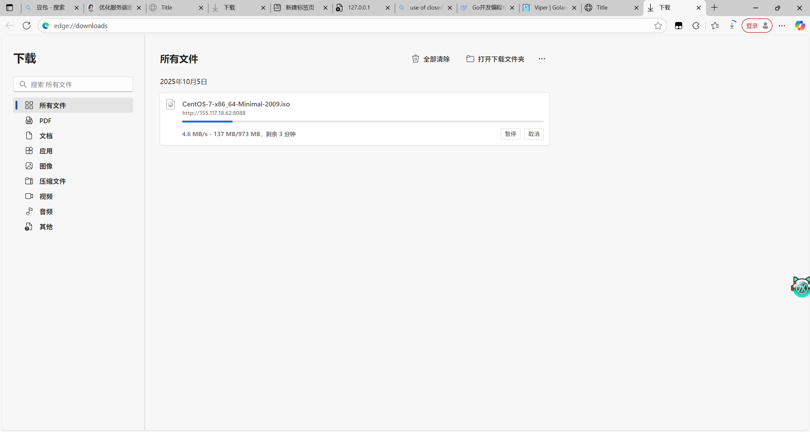

# golang内网穿透

- 多协程与通道配合优化
- 心跳包维护主连接
- 服务端优雅重连
- 主连接+任务连接保证大文件穿透稳定传输
- 使用缓冲区进行读写交换
- yml配置 手动配置服务各个参数（缓冲区大小，通道大小，心跳包时间等）

## 说明
- server端： 具有公网地址的服务器
- client端： 需要内网穿透的主机

## 使用

server端, web服务默认端口8088，client服务接口8080
```bash
go run server.go
```

client端 默认映射8090的服务
```bash
go run client.go
```

## 配置

<div align="center">
  
  <br>
</div>

```yml
#commion

#缓冲区大小
buffer-size: 5 #mb
#心跳包速度
keep-alive-time: 10 #s
#服务端端口
server-port: 8080

#server
#server 的web端端口
web-port: 8088
#服务端重连次数
connection-count: 5 #s
#服务端重连间隔时间
connection-timeout: 5
#接收任务请求的通道大小
conn-chan-count: 100

#client
#服务端ip
server-ip: 127.0.0.1
#本地服务端口
local-port: 8090
```

## 测试截图

包含网页，大文件穿透下载，多种协议穿透，开启服务端开机自启

<div align="center">
  
  <br>
</div>

<div align="center">
  
  <br>
</div>

<div align="center">
  
  <br>
</div>

<div align="center">
  
  <br>
</div>

<div align="center">
  
  <br>
</div>

<div align="center">
  
  <br>
</div>